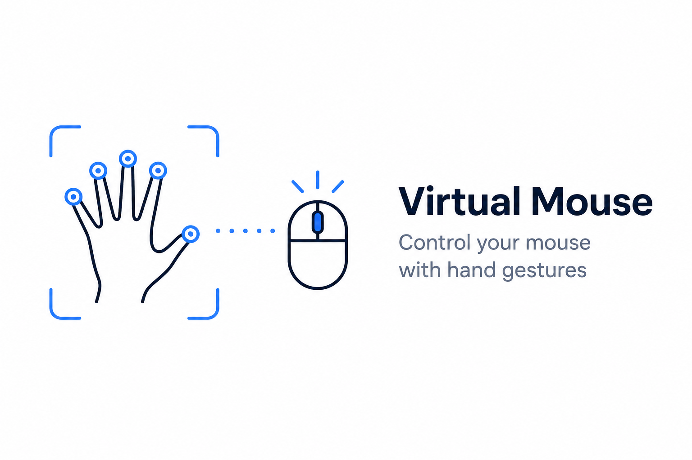

<h1 align = "center">
    <br>
    Virtual Mouse - Gesture Control System
    <br>
</h1>

<p align="center">
  <strong>Transform your webcam into a sophisticated AI-powered input device</strong>
  <br>
  <em>Desktop-grade cursor control with intuitive hand gestures</em>
</p>

<p align="center">
  <a href="https://www.python.org/">
    
  </a>
  <a href="https://mediapipe.dev/">
    
  </a>
  <a href="https://www.qt.io/qt-for-python">
    
  </a>
  <a href="https://opensource.org/licenses/MIT">
    
  </a>
</p>

<h1 align="center">
  
  
</h1>


<p align="center">
  <a href="#-key-features">Features</a> •
  <a href="#-gesture-reference">Gestures</a> •
  <a href="#-installation">Installation</a> •
  <a href="#-usage">Usage</a> •
  <a href="#%EF%B8%8F-configuration">Configuration</a> •
  <a href="#-architecture">Architecture</a>
</p>

---

## 📖 Overview

**HandGestureDetector** is a premium, AI-powered virtual mouse system that replaces your physical mouse with natural hand gestures. Built with MediaPipe's advanced hand tracking and high-performance interpolation algorithms, it delivers smooth, responsive cursor control that rivals traditional input devices.

Perfect for:
- 🎓 **Presentations** - Control slides hands-free
- ♿ **Accessibility** - Alternative input method for users with mobility challenges
- 🎮 **Interactive Displays** - Touch-free interaction for public installations
- 🚀 **Innovation** - Explore the future of human-computer interaction

---

## ✨ Key Features

<table>
  <tr>
    <td width="50%">
      <h3>🎯 Palm-Based Tracking</h3>
      <p>Uses the palm's center of mass instead of fingertips for rock-solid, jitter-free cursor movement.</p>
    </td>
    <td width="50%">
      <h3>🤝 Dual-Hand Control</h3>
      <p>Independently detects left and right hands, enabling complex multi-hand gestures and interactions.</p>
    </td>
  </tr>
  <tr>
    <td width="50%">
      <h3>🚀 120Hz Interpolation</h3>
      <p>High-frequency interpolation layer ensures buttery-smooth cursor movement comparable to premium gaming mice.</p>
    </td>
    <td width="50%">
      <h3>🌊 Smart Scrolling</h3>
      <p>Velocity-based scroll with acceleration curves and dead-zones for natural, precise document navigation.</p>
    </td>
  </tr>
  <tr>
    <td width="50%">
      <h3>🖥️ Dual-Dashboard System</h3>
      <p>Real-time telemetry window + dedicated hand skeleton visualization for complete system transparency.</p>
    </td>
    <td width="50%">
      <h3>🛡️ Toggle Protection</h3>
      <p>Accidental input prevention with 3-second hold gesture to enable/disable the entire system.</p>
    </td>
  </tr>
</table>

---

## 🎮 Gesture Reference

### Single-Hand Gestures (Right Hand)

<table align="center">
  <thead>
    <tr>
      <th width="20%">Gesture</th>
      <th width="15%">Visual</th>
      <th width="20%">Hand Configuration</th>
      <th width="25%">Action</th>
      <th width="20%">Notes</th>
    </tr>
  </thead>
  <tbody>
    <tr>
      <td align="center"><strong>Cursor Move</strong></td>
      <td align="center">☝️</td>
      <td>Index finger extended<br>Other fingers curled</td>
      <td><strong>Move cursor</strong><br>Palm-center tracking</td>
      <td>Primary control gesture<br>120Hz interpolation</td>
    </tr>
    <tr>
      <td align="center"><strong>Left Click</strong></td>
      <td align="center">🤏</td>
      <td>Thumb + Index pinch<br>Distance < 40px</td>
      <td><strong>Single click</strong><br>300ms cooldown</td>
      <td>Quick pinch = click<br>Hold for drag</td>
    </tr>
    <tr>
      <td align="center"><strong>Drag & Drop</strong></td>
      <td align="center">🤏⏱️</td>
      <td>Pinch held > 500ms</td>
      <td><strong>Click + Hold</strong><br>Drag mode active</td>
      <td>Release pinch to drop<br>Visual indicator shown</td>
    </tr>
    <tr>
      <td align="center"><strong>Vertical Scroll</strong></td>
      <td align="center">✌️</td>
      <td>Index + Middle up<br>Other fingers down</td>
      <td><strong>Scroll up/down</strong><br>Velocity-based</td>
      <td>Fast hand = fast scroll<br>Acceleration enabled</td>
    </tr>
    <tr>
      <td align="center"><strong>Toggle System</strong></td>
      <td align="center">✊⏱️</td>
      <td>Closed fist<br>Hold for 3 seconds</td>
      <td><strong>Enable/Disable</strong><br>System control</td>
      <td>Safety feature<br>Visual feedback shown</td>
    </tr>
  </tbody>
</table>

### Single-Hand Gestures (Left Hand)

<table align="center">
  <thead>
    <tr>
      <th width="20%">Gesture</th>
      <th width="15%">Visual</th>
      <th width="20%">Hand Configuration</th>
      <th width="25%">Action</th>
      <th width="20%">Notes</th>
    </tr>
  </thead>
  <tbody>
    <tr>
      <td align="center"><strong>Right Click</strong></td>
      <td align="center">🤏</td>
      <td>Thumb + Index pinch<br>(Left hand)</td>
      <td><strong>Context menu</strong><br>Right-click action</td>
      <td>Independent of right hand<br>300ms cooldown</td>
    </tr>
  </tbody>
</table>

### Dual-Hand Gestures (Both Hands Required)

<table align="center">
  <thead>
    <tr>
      <th width="20%">Gesture</th>
      <th width="15%">Visual</th>
      <th width="20%">Hand Configuration</th>
      <th width="25%">Action</th>
      <th width="20%">Notes</th>
    </tr>
  </thead>
  <tbody>
    <tr>
      <td align="center"><strong>Minimize Window</strong></td>
      <td align="center">🤏🤏</td>
      <td>Both hands pinch<br>Simultaneously</td>
      <td><strong>Hide active app</strong><br>Minimize to taskbar</td>
      <td>500ms timing tolerance<br>Works across all apps</td>
    </tr>
    <tr>
      <td align="center"><strong>Open Terminal</strong></td>
      <td align="center">✊✊⚡⚡</td>
      <td>Both hands closed fist<br>Pinch twice rapidly</td>
      <td><strong>Launch terminal</strong><br>Windows Terminal/cmd</td>
      <td>Double-pinch gesture<br>Quick succession</td>
    </tr>
  </tbody>
</table>

### Gesture Summary

<p align="center">
  <strong>6 Single-Hand Gestures</strong> + <strong>2 Dual-Hand Gestures</strong> = <strong>8 Total Commands</strong>
</p>

<p align="center">
  
  
  
</p>

---

## 🏗️ Architecture

HandGestureDetector follows a **3-layer self-annealing architecture** for maximum stability, maintainability, and extensibility:

```
┌─────────────────────────────────────────────────────────────┐
│                    1. DIRECTIVES LAYER                       │
│         Standard Operating Procedures (Markdown)             │
│                  Defines WHAT to do                          │
└────────────────────────┬────────────────────────────────────┘
│
┌────────────────────────▼────────────────────────────────────┐
│                   2. ORCHESTRATION LAYER                     │
│          Core Logic (main.py + /modules)                     │
│      Manages data flow between sensors & executors           │
└────────────────────────┬────────────────────────────────────┘
│
┌────────────────────────▼────────────────────────────────────┐
│                    3. EXECUTION LAYER                        │
│        Deterministic Scripts (/execution)                    │
│     Environment-specific tasks & OS-level calls              │
└─────────────────────────────────────────────────────────────┘
```


### Layer Details

| Layer | Location | Purpose | Example |
|:------|:---------|:--------|:--------|
| **Directives** | `/directives/*.md` | Define system behavior and requirements | Gesture definitions, timing thresholds |
| **Orchestration** | `/modules/*.py`, `main.py` | Coordinate between components | Hand detection → Gesture recognition → Action |
| **Execution** | `/execution/*.py` | Perform platform-specific operations | Window management, terminal launch |

This architecture ensures:
- ✅ **Separation of Concerns** - Each layer has a single responsibility
- ✅ **Easy Maintenance** - Change directives without touching code
- ✅ **Cross-Platform** - Swap execution scripts per OS
- ✅ **Testability** - Mock layers independently

---

## 🛠️ Tech Stack

<table align="center">
  <tr>
    <td align="center" width="25%">
      <br>
      <strong>Python 3.10+</strong><br>
      <em>Core Runtime</em>
    </td>
    <td align="center" width="25%">
      <br>
      <strong>MediaPipe</strong><br>
      <em>Hand Tracking AI</em>
    </td>
    <td align="center" width="25%">
      <br>
      <strong>OpenCV</strong><br>
      <em>Computer Vision</em>
    </td>
    <td align="center" width="25%">
      <br>
      <strong>PySide6 (Qt)</strong><br>
      <em>GUI Framework</em>
    </td>
  </tr>
</table>

**Additional Libraries:**
- **pynput** - Cross-platform mouse control
- **pygetwindow** - Window management (Windows)
- **screeninfo** - Multi-monitor support
- **numpy** - Numerical operations

---

## 🚀 Installation

### Prerequisites

- **Python 3.8+** ([Download here](https://www.python.org/downloads/))
- **Webcam** (built-in or USB)
- **Windows/Linux/macOS** (cross-platform support)

### Quick Start

#### Option 1: Automated Setup (Windows)

```bash
# Clone the repository
git clone https://github.com/yourusername/HandGestureDetector.git
cd HandGestureDetector

# Run the launcher (automatically sets up environment)
run.bat
```

#### Option 2: Manual Installation (All Platforms)

```bash
# Clone the repository
git clone https://github.com/yourusername/HandGestureDetector.git
cd HandGestureDetector

# Create virtual environment
python -m venv venv

# Activate virtual environment
# Windows:
venv\Scripts\activate
# Linux/macOS:
source venv/bin/activate

# Install dependencies
pip install -r requirements.txt

# Run the application
python main.py
```

### Linux Additional Setup

For window management features on Linux:

```bash
sudo apt-get update
sudo apt-get install wmctrl
```

---

## 💻 Usage

### Starting the Application

1. **Launch** the application using `run.bat` (Windows) or `python main.py` (all platforms)
2. **Allow** webcam access when prompted
3. **Two windows** will appear:
   - **Status Dashboard** - System telemetry and controls
   - **Hand Visualization** - Live hand skeleton overlay

### Basic Workflow

- Show your RIGHT hand to the camera
- System detects hand and displays green skeleton
- Extend INDEX finger only
- Cursor begins tracking palm movement
- Pinch THUMB + INDEX together
- Performs left click
- Hold pinch for 500ms
- Enters drag mode (move hand while pinching)
- Show BOTH hands and pinch simultaneously
- Minimizes active window

### Toggling Control

To **disable** virtual mouse control (prevent accidental inputs):
1. Make a **closed fist** with right hand
2. **Hold for 3 seconds**
3. System displays **"DISABLED"** status

To **re-enable**:
- Repeat the same gesture

### Tips for Best Performance

- ✅ **Lighting** - Ensure good lighting on your hands
- ✅ **Background** - Plain backgrounds improve detection
- ✅ **Distance** - Keep hands 1-2 feet from camera
- ✅ **Angle** - Face palms toward camera for best tracking
- ✅ **Calibration** - First-time users: adjust sensitivity in settings

---

## ⚙️ Configuration

All settings are located in **`config/settings.py`**. Customize the system to your preferences:

### Core Settings

```python
CONFIG = {
    # Detection
    'MIN_DETECTION_CONFIDENCE': 0.7,    # Hand detection threshold (0-1)
    'MIN_TRACKING_CONFIDENCE': 0.5,     # Tracking stability threshold
    'MAX_NUM_HANDS': 2,                 # Enable dual-hand detection
    
    # Cursor Control
    'CURSOR_SMOOTHING_ALPHA': 0.3,      # Lower = smoother (0.1-0.5)
    'CURSOR_DEAD_ZONE_PX': 5,           # Minimum movement threshold
    'INTERPOLATION_RATE_HZ': 120,       # Cursor refresh rate
    
    # Gestures
    'CLICK_THRESHOLD_PX': 40,           # Pinch distance for click
    'DRAG_HOLD_TIME_MS': 500,           # Hold duration to start drag
    'CLICK_COOLDOWN_MS': 300,           # Prevent double-clicks
    
    # Scroll
    'SCROLL_SENSITIVITY': 1.5,          # Scroll speed multiplier
    'SCROLL_ACCELERATION_ENABLED': True,
    'SCROLL_SMOOTHING_FRAMES': 10,
    
    # Toggle
    'TOGGLE_HOLD_DURATION_MS': 3000,    # Fist hold time to toggle
    
    # Display
    'CAMERA_WIDTH': 640,
    'CAMERA_HEIGHT': 480,
    'MIRROR_CAMERA': True,              # Mirror for natural movement
}
```

### Performance Tuning

**For slower computers:**
```python
'INTERPOLATION_RATE_HZ': 60,          # Reduce to 60Hz
'CAMERA_WIDTH': 320,                   # Lower resolution
'CAMERA_HEIGHT': 240,
```

**For ultra-smooth experience:**
```python
'INTERPOLATION_RATE_HZ': 240,         # Increase to 240Hz
'CURSOR_SMOOTHING_ALPHA': 0.2,        # More aggressive smoothing
```

---

## 📂 Project Structure

```
HandGestureDetector/
│
├── 📁 config/                    # Configuration files
│   └── settings.py               # System settings and constants
│
├── 📁 directives/                # Standard Operating Procedures
│   ├── gesture_definitions.md    # Gesture specifications
│   └── system_behavior.md        # System logic definitions
│
├── 📁 execution/                 # Platform-specific executors
│   ├── window_manager.py         # Window management (minimize, etc.)
│   └── terminal_launcher.py      # Terminal/cmd launcher
│
├── 📁 modules/                   # Core application logic
│   ├── init.py
│   ├── hand_detector.py          # MediaPipe hand detection wrapper
│   ├── gesture_recognizer.py    # Gesture identification logic
│   ├── cursor_smoother.py        # Cursor smoothing algorithms
│   ├── mouse_controller.py       # Mouse action executor
│   ├── state_manager.py          # System state machine
│   └── gui_dashboard.py          # PySide6 GUI components
│
├── 📁 utils/                     # Helper utilities
│   ├── init.py
│   ├── helpers.py                # Utility functions
│   ├── error_handler.py          # Error management
│   ├── calibration.py            # Calibration wizard
│   └── visualization.py          # OpenCV drawing functions
│
├── 📄 main.py                    # Application entry point
├── 📄 run.bat                    # Windows launcher script
├── 📄 requirements.txt           # Python dependencies
├── 📄 README.md                  # This file
├── 📄 LICENSE                    # MIT License
└── 📄 .gitignore                 # Git ignore rules
```

## MIT License

Copyright (c) 2024 HandGestureDetector
Permission is hereby granted, free of charge, to any person obtaining a copy
of this software and associated documentation files (the "Software"), to deal
in the Software without restriction, including without limitation the rights
to use, copy, modify, merge, publish, distribute, sublicense, and/or sell
copies of the Software, and to permit persons to whom the Software is
furnished to do so, subject to the following conditions:
[Full license text...]

---

## 🙏 Acknowledgments

- **MediaPipe Team** - For the incredible hand tracking ML model
- **OpenCV Community** - For robust computer vision tools
- **Qt/PySide6** - For the professional GUI framework
- **Contributors** - Everyone who has helped improve this project

---

## 📧 Contact

**Project Maintainer:** Your Name

- GitHub: [@yourusername](https://github.com/yourusername)
- Email: your.email@example.com
- Twitter: [@yourhandle](https://twitter.com/yourhandle)

**Project Link:** [https://github.com/yourusername/HandGestureDetector](https://github.com/yourusername/HandGestureDetector)

---

## ⭐ Show Your Support

If this project helped you, please consider giving it a ⭐️!

[](https://star-history.com/#yourusername/HandGestureDetector&Date)

---

<p align="center">
  <strong>Made with ❤️ and ☕ for a more intuitive desktop experience</strong>
  <br><br>
  
  
  
</p>

---

<p align="center">
  <sub>Built with Python • Powered by MediaPipe • Designed for Everyone</sub>
</p>